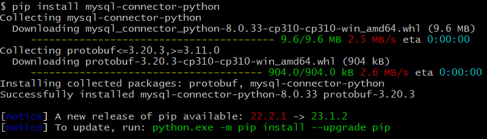

# Łączenie z bazą

Tutaj przedstawiamy łączenie z bazą w oparciu o popularne na backendzie języki programowania.

## Spis treści
* [Dane dostępowe](#Dane-dostępowe)
* [PHP](#PHP)
* [Python](#Python)
* [javascript](#javascript)
* [wspólne cechy](#wspólne-cechy)
* [dodatek: systemy obsługi pakietów](#dodatek-systemy-obsługi-pakietów)

## Dane dostępowe
Dane dostępowe dla każdego z przykładów znajdują się w pliku ```config.json```...
Ale, zaraz zaraz - powiecie - tu nie ma żadnego pliku ```config.json```!
I rzeczywiście, pliku takiego nie ma, gdyż ścieżka do niego zamieszczona została
w pliku .gitignore - przez co git ignoruje istnienie tego pliku.

Dlaczego tak?

Plik ```config.json``` zawiera bardzo wrażliwe dla nas dane - dane dostępowe, tzw. credentials,
albo mówiąd potocznie "kredki" - do bazy danych, którą dla Was utworzyliśmy.
Z tego powodu, zostanie on Wam dostarczony w inny sposób (np. przez slacka).

Dobrą praktyką jest zamieszczanie zamiast prawdziwego pliku dostępowego / konfiguracyjnego
przykładowego, bliźniaczego pliku z jego strukturą - ale bez wrażliwych danych.

I tak właśnie zrobiliśmy.

W repozytorium znajduje się plik ```config.sample.json``` w którym możecie podejrzeć strukturę pliku ```config.json```

Na próbę możecie przed wrzuceniem właściwego pliku ```config.json``` wrzucić kopię pliku ```config.json``` o nazwie ```config.json```, uruchomić kod z przykładów i prześledzić jakie pojawiają się wtedy błędy.

Sprawdzone?

To teraz wrzućcie właściwy plik.

Pora na omówienie łączenia z bazą.

[Na górę](#Spis-treści)

## PHP

PHP znacie dobrze ze szkoły. W odróżnieniu od pozostałych języków, w PHP-ie nie musimy
zaciągać obsługi mysql pakietów (narzędziem do obsługi pakietów programistycznych w PHP jest
Composer), a wystarczy ją włączyć w Apache'u (w XAMPPie jest standardowo włączona).

W PHP są trzy sposoby łączenia się z bazą mysql:

- mysql
- mysqli
- PDO

Pierwszy z nich nie jest już wspierany i nie należy go używać (a tam, gdzie zobaczycie
jego użycie, zmieniajcie na któryś z nowszych sposobów).

W plikach: ```mysqli.php``` i ```pdo.php``` macie przykłady, jak to zakodować.
Tutaj przeklejam tylko drugi z tych plików, dla celów porównawczych z innymi językami programowania:

```
<?php
// Wczytanie danych dostępowych z pliku konfiguracyjnego
$configFile = file_get_contents('config.json');
$config = json_decode($configFile, true);

// Ustalenie połączenia z bazą danych za pomocą PDO
$dsn = 'mysql:host=' . $config['host'] . ';dbname=' . $config['database'];
$pdo = new PDO($dsn, $config['user'], $config['password']);

// Ustawienie opcji, aby zgłaszać błędy w przypadku problemów z zapytaniami
$pdo->setAttribute(PDO::ATTR_ERRMODE, PDO::ERRMODE_EXCEPTION);

// Wykonanie zapytania SQL
$query = "SELECT * FROM score";
$result = $pdo->query($query);

// Przetwarzanie wyników
while ($row = $result->fetch(PDO::FETCH_ASSOC)) {
    print_r($row);
}

// Zamknięcie połączenia
$pdo = null;
```

[Na górę](#Spis-treści)

## Python

W Pythonie, podobnie jak w PHP-ie (i w innych językach, jak zauważycie dalej) - by
połączyć się z bazą należy dostarczyć odpowiednich danych dostępowych: hosta, loginu, hasła
i bazy danych z którą chcemy się połączyć:

```
## to tylko przykład - nie wpisujcie tego ręcznie, czyli tak:
mydb = mysql.connector.connect(
  host="przykładowo localhost",
  user="użytkownik",
  password="hasło",
  database="baza danych"
)
```

jednak tak jak wspomniałem, będziemy korzystać z pliku config.json, który pobierzemy
do zmiennej config:

```
mydb = mysql.connector.connect(**config)
```

Całość kodu będzie wyglądać tak:

```
import json
import mysql.connector

# Wczytanie danych dostępowych z pliku konfiguracyjnego
with open('config.json') as f:
    config = json.load(f)

# Ustalenie połączenia z bazą danych
mydb = mysql.connector.connect(**config)

# Utworzenie obiektu kursora
cursor = mydb.cursor()

# Wykonanie zapytania SQL
cursor.execute("SELECT * FROM score")

# Pobranie wyników zapytania
results = cursor.fetchall()

# Przetwarzanie wyników
for row in results:
  print(row)

# Zamknięcie połączenia z bazą danych
mydb.close()

```

Przed uruchomieniem skryptu należy zainstalować moduł `mysql-connector-python`. Możesz to zrobić za pomocą polecenia:

```pip install mysql-connector-python.```



Sam plik uruchamiamy przez:

```python database_connection.py```

da to efekt zbliżony do poniższego:


[Na górę](#Spis-treści)

## Javascript

Javascript dotąd poznaliście tylko od strony frontendu, jako domyślny język skryptowy stron
html (w tej chwili właściwie należało by rzecz - jedyny - bo wyparł on inne tego typu).

Jednak js używa się również na backendzie, dzięki wykorzystaniu środowiska node.js.

Upewnij się, że zainstalowałeś Node.js na swoim komputerze. Możesz to sprawdzić, wykonując polecenie node --version w terminalu. Jeśli Node.js nie jest zainstalowany, pobierz i zainstaluj go z oficjalnej strony Node.js (https://nodejs.org).

Podobnie jak w przypadku Pythona, także w Javascripcie, najpierw należy pobrać odpowiednie
zależności (użyjemy do tego npm-a)

W tym celu w katalogu ```łączenieZBazą``` wydaj polecenie:

```npm install```

efekt będzie zbliżony do poniższego:


Zwróć uwagę, że sam kod jest podobny do tego w PHP-ie i Pythonie, wykonujemy podobne operacje:

```
const fs = require('fs');
const mysql = require('mysql');

// Wczytanie danych dostępowych z pliku konfiguracyjnego
const config = JSON.parse(fs.readFileSync('config.json', 'utf8'));

// Ustalenie połączenia z bazą danych
const connection = mysql.createConnection(config);

// Nawiązanie połączenia
connection.connect((err) => {
  if (err) {
    console.error('Błąd połączenia:', err);
    return;
  }
  
  console.log('Połączono z bazą danych!');
  
  // Wykonanie zapytania SQL
  connection.query('SELECT * FROM score', (err, results) => {
    if (err) {
      console.error('Błąd zapytania:', err);
      return;
    }
    
    // Przetwarzanie wyników
    results.forEach((row) => {
      console.log(row);
    });
    
    // Zamknięcie połączenia
    connection.end();
  });
});
```

Teraz - gdy już masz node i kod `database_connection.js` możesz go uruchomić komendą
z poziomu terminala:

```node database_connection.js```

Efekt powinien przypominać ten:


[Na górę](#Spis-treści)

## C#

Językiem C# szerzej się zajmiemy, gdy będziemy tworzyć projekty w Unity,
tutaj tylko wrzucam przykład, wraz z procedurą uruchomienia (jest to dość skomplikowane,
zdaję sobie z tego sprawę)

```
using System;
using System.Data;
using MySql.Data.MySqlClient;
using System.IO;
using Newtonsoft.Json;

class Program
{
    static void Main()
    {
        // Wczytanie danych dostępowych z pliku konfiguracyjnego
        string configFile = File.ReadAllText("config.json");
        var config = JsonConvert.DeserializeObject<Config>(configFile);

        // Ustalenie połączenia z bazą danych
        string connectionString = $"Server={config.Host};Database={config.Database};Uid={config.User};Pwd={config.Password};";
        using (MySqlConnection connection = new MySqlConnection(connectionString))
        {
            try
            {
                // Otwarcie połączenia
                connection.Open();
                Console.WriteLine("Połączono z bazą danych!");

                // Wykonanie zapytania SQL
                string query = "SELECT * FROM score";
                MySqlCommand command = new MySqlCommand(query, connection);
                MySqlDataReader reader = command.ExecuteReader();

                // Przetwarzanie wyników
                while (reader.Read())
                {
                    for (int i = 0; i < reader.FieldCount; i++)
                    {
                        Console.Write(reader[i] + "\t");
                    }
                    Console.WriteLine();
                }

                reader.Close();
            }
            catch (Exception ex)
            {
                Console.WriteLine("Błąd: " + ex.Message);
            }
        }

        Console.ReadLine();
    }

    // Klasa pomocnicza do deserializacji danych dostępowych z pliku konfiguracyjnego
    private class Config
    {
        public string Host { get; set; }
        public string User { get; set; }
        public string Password { get; set; }
        public string Database { get; set; }
    }
}

```

Kod w C# można skompilować i odpalić przykładowo z poziomu Visual Studio, albo z poziomu
konsoli.

Sposób 1, z wykorzystaniem Visual Studio:

1. Stwórz nowy projekt w środowisku programistycznym C#, takim jak Visual Studio lub Visual Studio Code. Wybierz odpowiedni rodzaj projektu (np. aplikacja konsolowa) i nazwij go według własnego uznania.

2. W projekcie dodaj nowy plik, klikając prawym przyciskiem myszy na drzewie projektu i wybierając opcję "Dodaj" > "Nowy element". Wybierz plik typu "C# Class" lub "C# Source File" i nadaj mu nazwę (w tym przypadku Database_Connection.cs).

3. Wklej kod C# z tego repozytorium do utworzonego pliku .cs.

4. Jeśli korzystasz z pełnego Visual Studio (a nie Visual Studio Code) to teraz kliknij przycisk "Uruchom" lub użyj skrótu klawiaturowego Ctrl + F5, aby skompilować i uruchomić projekt. Jeśli korzystasz z Visual Studio Code, otwórz terminal, przejdź do katalogu projektu i użyj polecenia dotnet run w celu kompilacji i uruchomienia projektu.

Możliwe, że ta operacja się nie uda, bo nie masz zainstalowanych odpowiednich pakietów NuGet.
By je zainstalować w oknie projektu Visual Studio trzeba kliknąć prawym przyciskiem na projekt wybrać `zarządzaj pakietami NuGet` a następnie zainstalować odpowiednie paczki, to jest:

```MySql.Data.SqlClient```

i

```Newtonsoft.Json```


Przy kompilacji kodu C#, zostanie utworzony plik wykonywalny (.exe), który można uruchomić na systemie Windows. Plik ten zostanie utworzony w domyślnym katalogu bin/Debug lub bin/Release, w zależności od konfiguracji projektu.

Sposób 2, z wykorzystaniem linii komend:

1. Upewnij się, że masz zainstalowany zestaw narzędzi do programowania w języku C# (SDK). Możesz go pobrać ze strony internetowej Microsoftu, na przykład z oficjalnej strony .NET (https://dotnet.microsoft.com/download).

2. Zapisz kod C# w pliku o rozszerzeniu .cs

3. Otwórz terminal lub wiersz polecenia i przejdź do katalogu, w którym znajduje się plik .cs.

4. Wykonaj polecenie dotnet new console, aby utworzyć nowy projekt konsolowy. Spowoduje to utworzenie pliku dotnet.csproj i katalogu obj.

5. Skopiuj plik .cs (np. Database_Connection.cs) do utworzonego katalogu projektu.

Wykonaj polecenie ```dotnet build```, aby skompilować projekt. Skompilowany plik wykonywalny (.exe) zostanie utworzony w katalogu bin/Debug lub bin/Release, w zależności od konfiguracji projektu.

Wykonaj polecenie ```dotnet run```, aby uruchomić skompilowany plik wykonywalny.

Efekt działania będzie przypominał poniższy skrin:


[Na górę](#Spis-treści)

## wspólne cechy

Zauważcie, że bez względu na to w jakim języku napisaliśmy obsługę bazy danych,
algorytm postępowania był mniej więcej taki sam:


1. Wczytaj zawartość pliku konfiguracyjnego (np. config.json) do zmiennej 'config'.

2. Utwórz połączenie z bazą danych:
    - Dla Pythona:
        a. Importuj bibliotekę do obsługi bazy danych (np. pymysql).
        b. Utwórz połączenie używając danych z 'config'.

    - Dla Node.js:
        a. Zaimportuj bibliotekę do obsługi bazy danych (np. mysql2).
        b. Utwórz połączenie używając danych z 'config'.

    - Dla PHP:
        a. Wczytaj zawartość pliku konfiguracyjnego (np. config.json) do zmiennej 'config'.
        b. Utwórz połączenie używając danych z 'config'.

    - Dla C#:
        a. Utwórz obiekt konfiguracji na podstawie danych z 'config'.
        b. Utwórz łańcuch połączenia z danymi z obiektu konfiguracji.
        c. Utwórz połączenie z bazą danych na podstawie łańcucha połączenia.

3. Wykonaj zapytanie SQL na połączeniu:
    - Dla Pythona:
        a. Utwórz kursor na podstawie połączenia.
        b. Wykonaj zapytanie SQL na kursorze.

    - Dla Node.js:
        a. Wywołaj odpowiednią funkcję/metodę na obiekcie połączenia, aby wykonać zapytanie SQL.

    - Dla PHP:
        a. Utwórz zapytanie SQL jako łańcuch znaków.
        b. Wykonaj zapytanie SQL na połączeniu.

    - Dla C#:
        a. Utwórz obiekt SqlCommand na podstawie zapytania SQL i połączenia.
        b. Wykonaj zapytanie SQL za pomocą obiektu SqlCommand.

4. Przetwarzaj wyniki zapytania:
    - Dla Pythona:
        a. Iteruj przez wyniki i przetwarzaj dane.

    - Dla Node.js:
        a. Wykorzystaj odpowiednią metodę/funkcję do przetwarzania wyników zapytania.

    - Dla PHP:
        a. Przetwarzaj wyniki zapytania, np. za pomocą pętli while.

    - Dla C#:
        a. Użyj obiektu SqlDataReader do odczytania i przetwarzania wyników zapytania.

5. Zamknij połączenie z bazą danych.

[Na górę](#Spis-treści)

## dodatek: systemy obsługi pakietów

Python:

System obsługi pakietów: pip

pip jest standardowym systemem zarządzania pakietami dla języka Python. Pozwala on na instalację, aktualizację i usuwanie pakietów Python z repozytoriów PyPI (Python Package Index). Można go również wykorzystać do zarządzania zależnościami projektu, tworzenia wirtualnych środowisk i udostępniania własnych pakietów.


Node.js:

System obsługi pakietów: npm (Node Package Manager)

npm jest domyślnym systemem zarządzania pakietami dla środowiska Node.js. Umożliwia instalowanie, aktualizowanie i usuwanie pakietów Node.js z repozytoriów npm. Narzędzie to jest szeroko wykorzystywane do zarządzania zależnościami projektu, zarówno na etapie rozwoju, jak i wdrażania aplikacji Node.js.


PHP:

System obsługi pakietów: Composer

Composer jest narzędziem do zarządzania pakietami dla języka PHP. Pozwala na instalowanie, aktualizowanie i usuwanie pakietów PHP z repozytoriów Packagist. Composer umożliwia łatwe zarządzanie zależnościami projektu, automatyczne ładowanie klas, generowanie autoloaderów i inne funkcje, które ułatwiają rozwój aplikacji PHP.


C#:

System obsługi pakietów: NuGet

NuGet jest systemem zarządzania pakietami dla platformy .NET, w tym dla języka C#. Umożliwia instalowanie, aktualizowanie i usuwanie pakietów .NET z repozytoriów NuGet. NuGet jest często używany do zarządzania zależnościami bibliotek, dodatkowych narzędzi, szablonów projektów i innych składników używanych w aplikacjach .NET.


Wszystkie te systemy obsługi pakietów mają podobne cele: ułatwienie zarządzania zależnościami, instalowanie pakietów z repozytoriów, zarządzanie wersjami i zapewnienie prostoty w tworzeniu aplikacji, wykorzystujących gotowe komponenty. Są one niezwykle przydatne w procesie rozwijania aplikacji, pomagając programistom w łatwym dostępie do zewnętrznych bibliotek i narzędzi oraz w zarządzaniu zależnościami w skomplikowanych projektach.

[Na górę](#Spis-treści)
