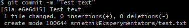
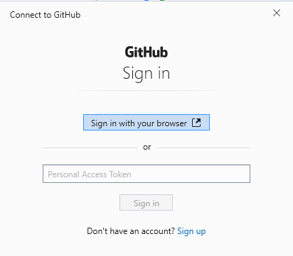
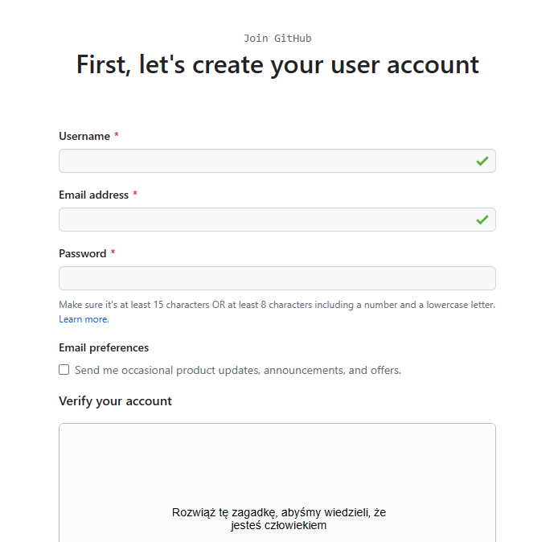
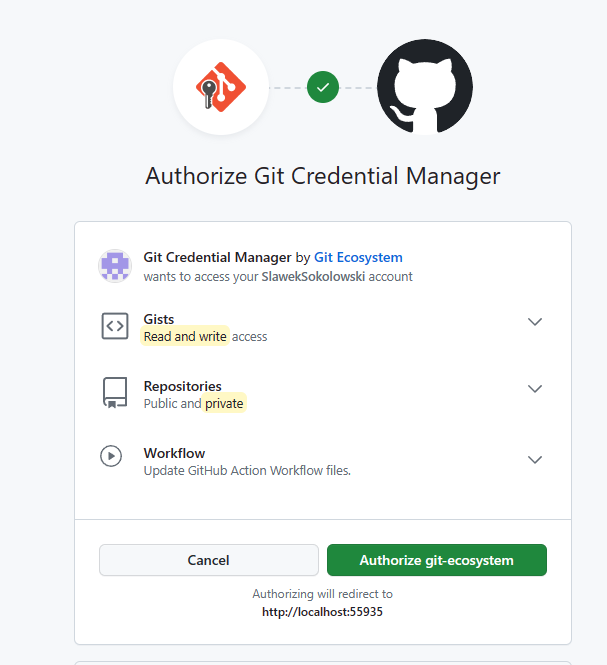
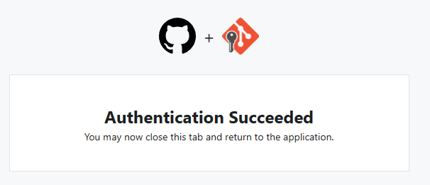
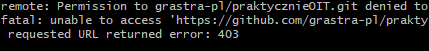

# Pierwsze kroki z githubem

Gdy już masz zainstalowanego git basha, możesz przystąpić do pierwszych prac z gitem...
Zanim jednak cokolwiek skomitujesz, musisz się przedstawić gitowi - powiedzieć mu, kim właściwie
jesteś.
Jeśli tego nie zrobisz, przy próbie commitowania pojawi się komunikat:


Zatem - przedstaw się.
Służą do tego komendy:

```git config --global user.name "Nazwa usera"```

by ustawić nazwę
i

```git config --global user.email "email@email.com"```

by ustawić email

Teraz możesz już commitować swoje zmiany.


Następnym krokiem będzie ściągnięcie zdalnego repozytorium.
By ściągnąć to repozytorium, którego ten opis jest częścią, wpisz komendę:

```git clone git@github.com:grastra-pl/praktycznieOIT.git```

Jeśli w tym momencie pojawi się komunikat podobny do poniższego:

```The authenticity of host 'github.com (140.82.113.4)' can't be established.```

należy dodać github do znanych hostów, na przykład tak:

```ssh-keyscan github.com >> ~/.ssh/known_hosts```

By zacząć pracować na tym repozytorium, pierwsze co powinieneś zrobić, to utworzyć własną gałąź drzewa
zmian, na której będziesz commitować swoje zmiany.
Można to zrobić wydając dwie komendy, jedną do utworzenia gałęzi (brancha), drugą, do przełączenia się
na tę gałąź.
Można jednak zrobić to krócej - jedną komendą, która utworzy gałąź i na nią przełączy.

Przyjmijmy standard, że osobista gałąź nazywa się od trzech pierwszych liter Twojego imienia i trzech pierwszych liter Twojego nazwiska, bez polskich liter - w moim przypadku będzie to:

```TymSok```

by utworzyć gałąź o takiej nazwie wydam polecenie:

```git checkout -b TymSok```

Zamiast "TymSok" wpisz swoje trzy pierwsze litery imienia i trzy pierwsze litery nazwiska.

Teraz spróbuj dodać coś do repo. Do eksperymentów służy katalog ```smietnikEksperymentatora```
w dowolny sposób (może być przy pomocy IDE) - utwórz w tym katalogu plik ```TwojeImieINazwisko.txt```
(zamiast "TwojeImieINazwisko" użyj swojego imienia i nazwiska)
jeśli chcesz to zrobić z poziomu git basha, użyj komend:

```cd smietnikEksperymentatora```

by przejść do katalogu smietnikEksperymentatora

i

```touch TwojeImieINazwisko.txt```

by utworzyć plik TwojeImieINazwisko.txt.

Pora teraz scommitować zmiany. Najpierw dodać je do paczki zmian:

```git add .```

a następnie skomitować:

```git commit -m "dodanie pliku TwojeImieINazwisko.txt"```

Teraz możesz już spuszować zmiany.
W przyszłości będziesz to robić prostą komendą ```git push```, ale github jeszcze nie wie nic
o Twoim niedawno utworzonym branczu (przypomnę, że o nazwie trzy litery imienia i trzy litery nazwiska)
więc robiąc pierwszy push trzeba powiązać lokalny branch z branchem na serwerze

```git push --set-upstream origin nazwaBrancha```

Jeśli nie jesteś zalogowany na gitHubie, nie masz tam konta itp. to prawdopodobnie teraz zobaczysz okno
takie jak to:



Pora utworzyć konto w tej usłudze. Kliknij w **Sign Up**



Gdy konto zostanie utworzone, należy jeszcze zautoryzować Credential Managera:



Gdy to zrobisz, pojawi się komunikat:



Jednak sukces jest dopiero częściowy.
Próba pusha zawodzi, pojawia się błąd 403, świadczący o braku uprawnień:


By mieć możliwość commitowania, musisz podać mi nazwę swojego konta gitHub (tego, które utworzyłeś
parę kroków wcześniej) - wtedy wyślę Ci zaproszenie do współtworzenia repozytorium, a gdy je przyjmiesz,
będziesz mógł pushować swoje zmiany do tego repo.
