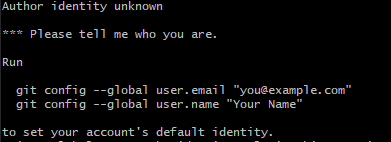

# Pierwsze kroki z githubem

Gdy już masz zainstalowanego git basha, możesz przystąpić do pierwszych prac z gitem...
Zanim jednak cokolwiek skomitujesz, musisz się przedstawić gitowi - powiedzieć mu, kim właściwie
jesteś.
Jeśli tego nie zrobisz, przy próbie commitowania pojawi się komunikat:



Zatem - przedstaw się gitowi.
Służą do tego komendy:

```git config --global user.name "Nazwa usera"```

by ustawić nazwę
i

```git config --global user.email "email@email.com"```
by ustawić email

Teraz możesz już commitować swoje zmiany.

Następnym krokiem będzie ściągnięcie zdalnego repozytorium.
By ściągnąć to repozytorium, którego ten opis jest częścią, wpisz komendę:

```git clone git@github.com:grastra-pl/praktycznieOIT.git```

By zacząć pracować na tym repozytorium, pierwsze co powinieneś zrobić, to utworzyć własną gałąź drzewa
zmian, na której będziesz commitować swoje zmiany.
Można to zrobić wydając dwie komendy, jedną do utworzenia gałęzi (brancha), drugą, do przełączenia się
na tę gałąź.
Można jednak zrobić to krócej - jedną komendą, która utworzy gałąź i na nią przełączy.
Przyjmijmy standard, że osobista gałąź nazywa się od trzech pierwszych liter Twojego imienia i trzech pierwszych liter Twojego nazwiska, bez polskich liter - w moim przypadku będzie to:

```TymSok```

by utworzyć gałąź o takiej nazwie wydam polecenie:
```git checkout -b TymSok```

Zamiast "TymSok" wpisz swoje trzy pierwsze litery imienia i trzy pierwsze litery nazwiska.

