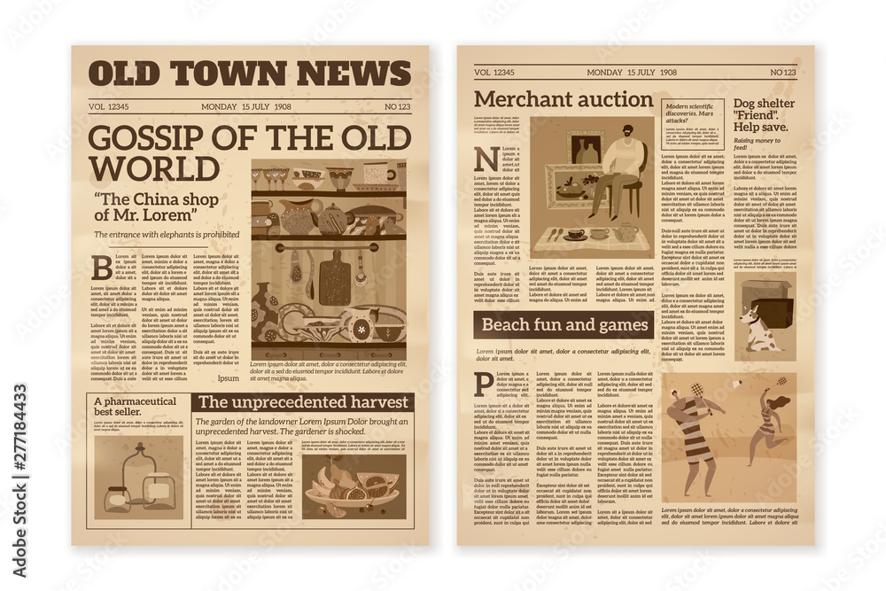
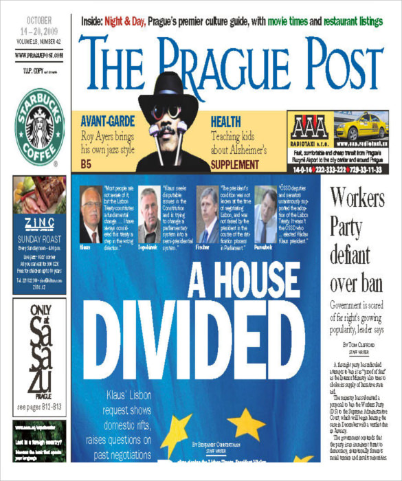
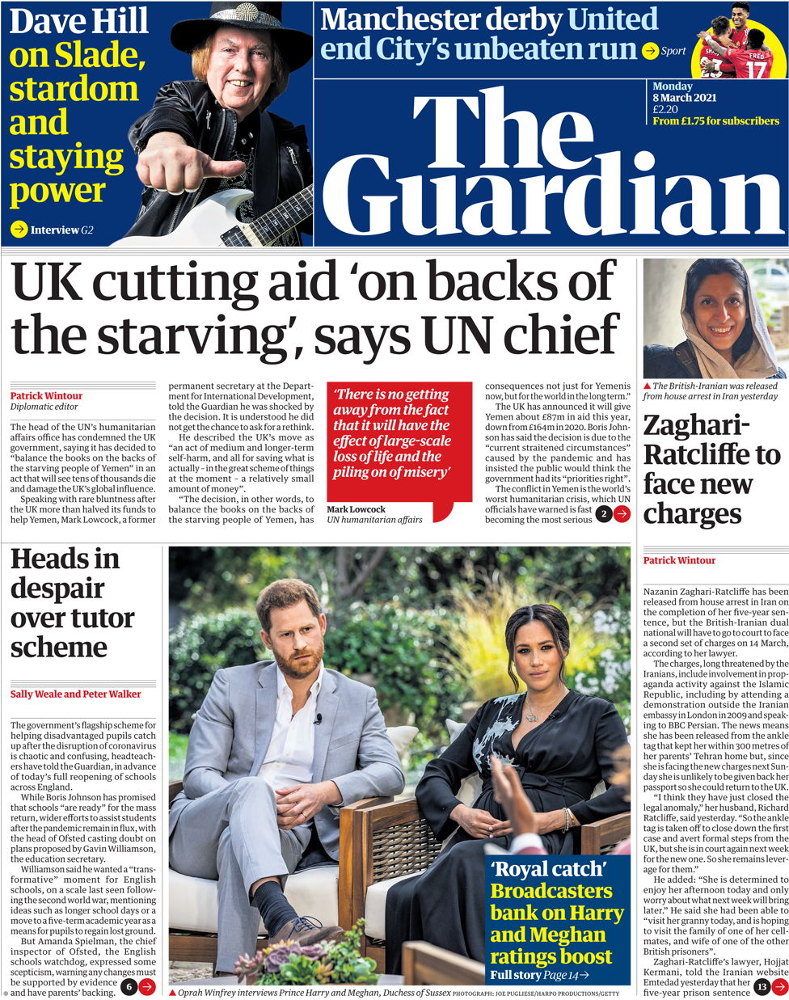
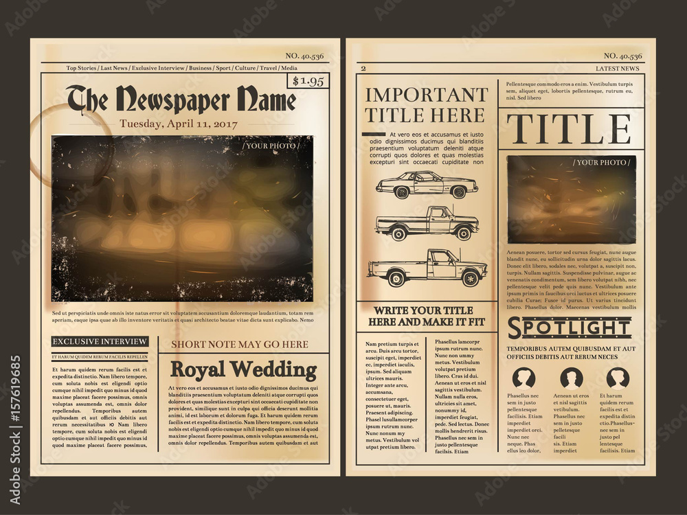

Makiety, znane również jako mockupy, są wizualnymi reprezentacjami interfejsu użytkownika lub struktury aplikacji, które są tworzone na wczesnym etapie procesu projektowania. Są to uproszczone i statyczne modele, które mają na celu przedstawienie wyglądu, układu i funkcjonalności planowanego oprogramowania lub witryny internetowej.

Makiety są tworzone przy użyciu narzędzi do projektowania interfejsu, takich jak oprogramowanie do tworzenia prototypów lub graficzne narzędzia projektowe. Mogą przybierać różne formy, takie jak szkice ręczne, wireframe'y (uproszczone struktury strony), prototypy interaktywne lub nawet statyczne obrazy.

Głównym celem tworzenia makiety jest przekazanie wizualnego wyobrażenia projektu i umożliwienie zainteresowanym stronom (klientom, projektantom, programistom) zrozumienia, jak aplikacja będzie wyglądać i działać przed przystąpieniem do fazy implementacji.

Makiety mają wiele korzyści. Oto kilka z nich:

1. Koncepcja i komunikacja: Makiety pomagają w zrozumieniu i komunikacji idei projektu. Pozwalają na wyjaśnienie wizji projektowej klientom i zespołowi deweloperów oraz uzyskanie ich opinii i uwag przed rozpoczęciem fazy implementacji.

2. Testowanie i ocena: Makiety umożliwiają testowanie interfejsu użytkownika, nawigacji i funkcjonalności przed przystąpieniem do programowania. Umożliwiają szybkie wprowadzanie zmian i dostosowanie projektu na podstawie otrzymanych informacji zwrotnych.

3. Planowanie i estymacja: Makiety pomagają w określaniu zakresu projektu, planowaniu harmonogramu oraz ocenie czasu i zasobów potrzebnych do implementacji. Mogą również służyć jako podstawa do opracowania specyfikacji funkcjonalnych.

4. Jednolitość i spójność: Makiety pozwalają na zapewnienie spójnego wyglądu i stylu interfejsu użytkownika we wszystkich częściach aplikacji. Umożliwiają projektantom i programistom przestrzeganie ustalonych wytycznych dotyczących wyglądu i zachowania.

Ważne jest, aby zrozumieć, że makiety są jedynie wizualnymi reprezentacjami projektu i nie zawierają rzeczywistej funkcjonalności. Mają one na celu ułatwienie procesu projektowania, komunikacji i oceny, a także minimalizację ryzyka błędów i kosztów późniejszych zmian.

Makiety tworzą czasem klienci (zarówno zewnętrzni jak i wewnętrzni), czasem tworzy się je z nimi wspólnie, czasem tworzone są przez product ownerów, analityków biznesowych, architektów, testerów a nawet samych programistów.

Z ciekawostek, kiedyś dostaliśmy makietę, w postaci zdjęcia kartki wyrwanej z zeszytu, z rysunkiem, trzymanej na kolanach klientki. I taki mockup też jest pełnoprawnym mockupem - o ile jest na nim wszystko wyraźnie rozrysowane - a było, czasem chcielibyśmy by makiety tworzone z użyciem profesjonalnego oprogramowania były tak dokładne jak te rysunki na kartkach.

Waszym pierwszym zadaniem z mockupami będzie odtworzenie w postaci stron htmlowych układu gazet, jakie zamieszczam jako przykład, każdy ma po jednej gazecie do obrobienia:

Pamiętajcie o użyciu właściwych jednostek:

https://www.w3.org/Style/Examples/007/units.pl.html

nie przejmujcie się krojem czcionek: niech wszędzie będzie Verdana